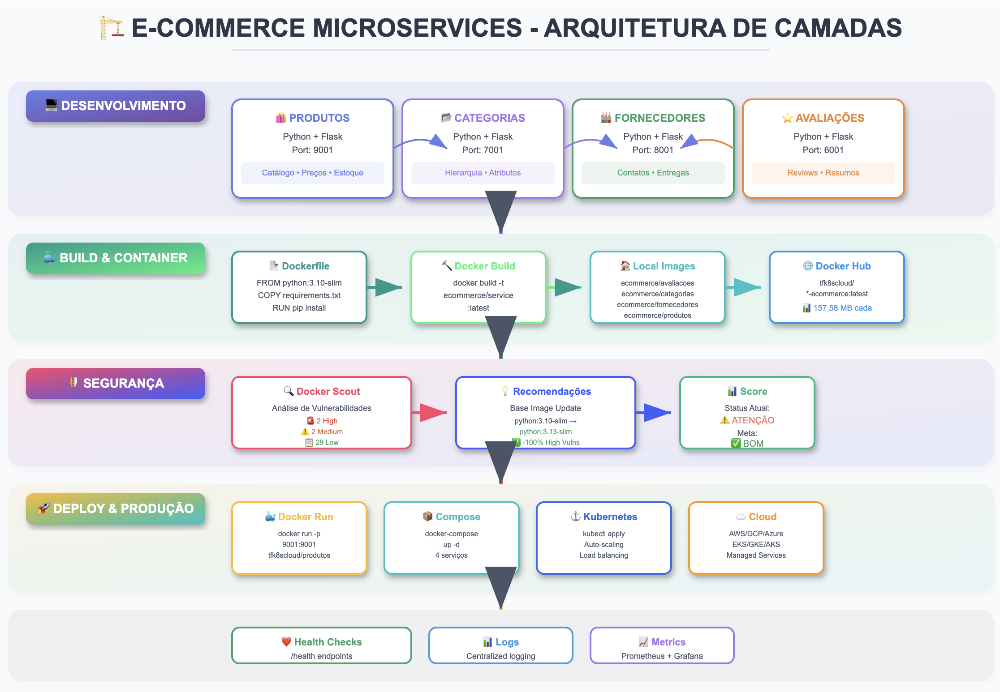
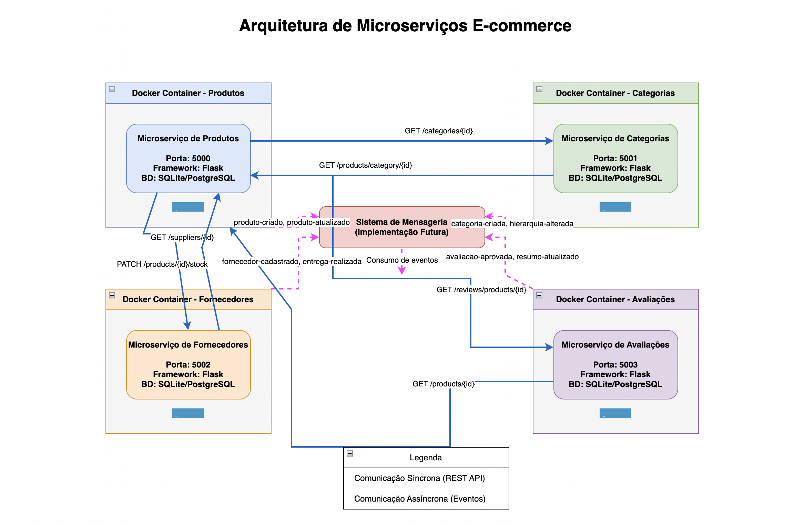
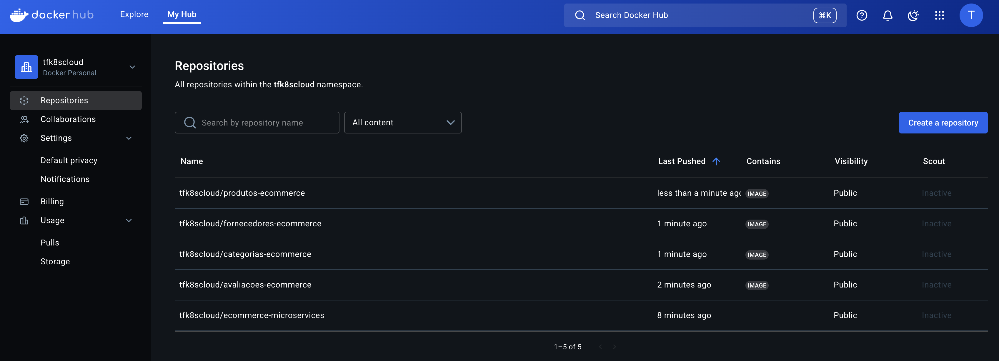
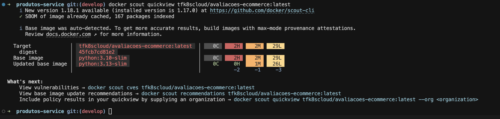
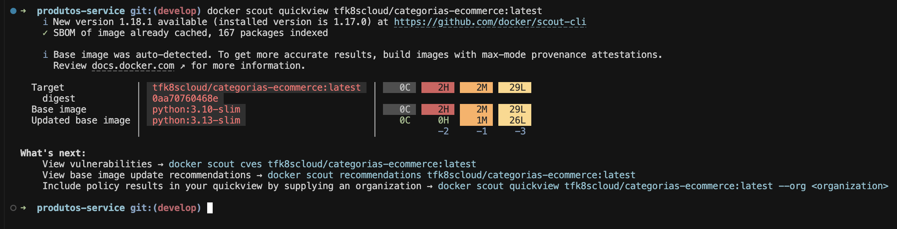
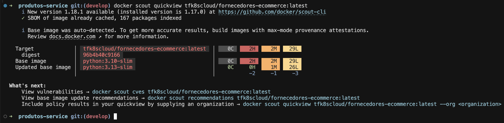
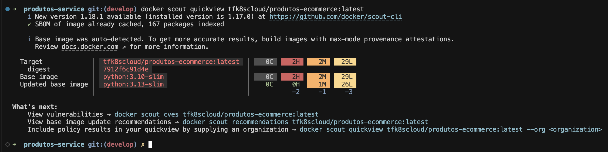

🛒 E-COMMERCE MICROSERVICES
===========================

<div align="center">



[](https://python.org/) [](https://flask.palletsprojects.com/) [](https://docker.com/) [](https://hub.docker.com/u/tfk8scloud)

**Sistema de e-commerce baseado em microserviços para gerenciamento de produtos, categorias, fornecedores e avaliações.**

[🚀 Quick Start](#-quick-start) - [📖 Documentação](#-documenta%C3%A7%C3%A3o) - [🛡️ Segurança](an%C3%A1lise-de-seguran%C3%A7a---docker-scout) - [🤝 Contribuir](#-contribui%C3%A7%C3%A3o)

</div>

* * * * *

📋 Índice
---------

-   [🏗️ Arquitetura](#-arquitetura)
-   [⚡ Tecnologias](#-tecnologias)
-   [🚀 Quick Start](#-quick-start)
-   [📁 Estrutura do Projeto](#-estrutura-do-projeto)
-   [🌐 API Endpoints](#-api-endpoints)
-   [🐳 Docker Hub](#-docker-hub)
-   [🛡️ Análise de Segurança](#-an%C3%A1lise-de-seguran%C3%A7a---docker-scout)
-   [🔄 Comunicação entre Serviços](#-comunica%C3%A7%C3%A3o-entre-servi%C3%A7os)
-   [🧪 Testes](#-testes)
-   [🚀 Roadmap](#-roadmap)
-   [🤝 Contribuição](#-contribui%C3%A7%C3%A3o)

* * * * *

🏗️ Arquitetura
---------------

### 🎯 Visão Geral



O projeto é baseado em **arquitetura de microserviços**, garantindo alta escalabilidade, manutenibilidade e independência entre os serviços.

### 🔧 Microserviços

| 🎯 Serviço | 📝 Descrição | 🌐 Porta | 🔗 Health Check |
| --- | --- | --- | --- |
| **🛍️ Produtos** | Gerencia catálogo, preços e estoque | `9001` | `/health` |
| **📂 Categorias** | Gerencia hierarquia e atributos | `7001` | `/health` |
| **🏭 Fornecedores** | Gerencia fornecedores e entregas | `8001` | `/health` |
| **⭐ Avaliações** | Gerencia reviews e resumos | `6001` | `/health` |

* * * * *

⚡ Tecnologias
-------------

### 🛠️ Stack Principal

<table> <tr> <td align="center" width="25%">  <br><strong>Python 3.10+</strong> <br><em>Backend Framework</em> </td> <td align="center" width="25%">  <br><strong>Flask</strong> <br><em>Web Framework</em> </td> <td align="center" width="25%">  <br><strong>Docker</strong> <br><em>Containerização</em> </td> <td align="center" width="25%">  <br><strong>Kubernetes</strong> <br><em>Orquestração</em> </td> </tr> </table>

### 📦 Dependências

```
# requirements.txt (comum a todos os serviços)
Flask==2.3.3
Flask-CORS==4.0.0
requests==2.31.0
gunicorn==21.2.0

```

* * * * *

🚀 Quick Start
--------------

### 📋 Pré-requisitos

| Ferramenta | Versão | Status | Download |
| --- | --- | --- | --- |
| **🐍 Python** | 3.10+ | ✅ Requerido | [python.org](https://python.org/) |
| **🐳 Docker** | Latest | ✅ Requerido | [docker.com](https://docker.com/) |
| **🔗 Git** | Latest | ✅ Requerido | [git-scm.com](https://git-scm.com/) |
| **🔧 Docker Compose** | Latest | 📋 Opcional | [docs.docker.com](https://docs.docker.com/compose/) |

### ⚡ Instalação Rápida

```
# 1️⃣ Clone o repositório
git clone https://github.com/ndevops25/e-commerce-microservices
cd e-commerce-microservices

# 2️⃣ Execute com Docker (Recomendado)
docker-compose up -d

```

### 🔧 Execução Manual (Desenvolvimento)

🛠️ Desenvolvimento Local
=========================

Esta seção aborda como gerar imagens Docker e testar os microserviços localmente durante o desenvolvimento.

📦 Gerando Imagens Docker
-------------------------

### 🏗️ Build Individual por Serviço

Construa cada microserviço separadamente para desenvolvimento e testes:

bash

```
# 📁 Navegue até o diretório raiz do projeto
cd e-commerce-microservices

# 🛍️ Microserviço de Produtos
cd services/produtos-service
docker build -t ecommerce/produtos:latest .
docker build -t ecommerce/produtos:dev .

🔄 Execução localmente
docker run -p 6001:6001 ecommerce/produtos:latest


# 📂 Microserviço de Categorias
cd ../categorias-service
docker build -t ecommerce/categorias:latest .
docker build -t ecommerce/categorias:dev .

🔄 Execução localmente
docker run -p 7001:7001 ecommerce/categorias:latest

# 🏭 Microserviço de Fornecedores
cd ../fornecedores-service
docker build -t ecommerce/fornecedores:latest .
docker build -t ecommerce/fornecedores:dev .

🔄 Execução localmente
docker run -p 8001:8001 ecommerce/fornecedores:latest

# ⭐ Microserviço de Avaliações
cd ../avaliacoes-service
docker build -t ecommerce/avaliacoes:latest .
docker build -t ecommerce/avaliacoes:dev .

🔄 Execução localmente
docker run -p 9001:9001 ecommerce/avaliacoes:latest
```

# 3️⃣ Verificar saúde dos serviços
curl http://localhost:9001/health  # Produtos
curl http://localhost:7001/health  # Categorias
curl http://localhost:8001/health  # Fornecedores
curl http://localhost:6001/health  # Avaliações

### 📊 Verificar Imagens Construídas

bash

```
# 📋 Listar todas as imagens do projeto
docker images | grep ecommerce

# 🔍 Inspecionar uma imagem específica
docker inspect ecommerce/produtos:latest

# 📊 Verificar tamanho das imagens
docker images --format "table {{.Repository}}\t{{.Tag}}\t{{.Size}}" | grep ecommerce
```

🧪 Testando Localmente
----------------------

### ⚡ Execução Rápida (Desenvolvimento)

#### 🔄 Método 1: Execução Individual

bash

```
# 🛍️ Produtos (Port: 9001)
docker run -d\
  --name produtos-dev\
  -p 9001:9001\
  -e FLASK_ENV=development\
  ecommerce/produtos:dev

# 📂 Categorias (Port: 7001)
docker run -d\
  --name categorias-dev\
  -p 7001:7001\
  -e FLASK_ENV=development\
  ecommerce/categorias:dev

# 🏭 Fornecedores (Port: 8001)
docker run -d\
  --name fornecedores-dev\
  -p 8001:8001\
  -e FLASK_ENV=development\
  ecommerce/fornecedores:dev

# ⭐ Avaliações (Port: 6001)
docker run -d\
  --name avaliacoes-dev\
  -p 6001:6001\
  -e FLASK_ENV=development\
  ecommerce/avaliacoes:dev
```

Execute o ambiente de desenvolvimento:

bash

```
# 🚀 Subir ambiente de desenvolvimento
docker-compose -f docker-compose.dev.yml up -d --build

# 📊 Verificar status
docker-compose -f docker-compose.dev.yml ps

# 📋 Ver logs
docker-compose -f docker-compose.dev.yml logs -f

# 🛑 Parar ambiente
docker-compose -f docker-compose.dev.yml down
```

### 🧪 Testes de API

#### 📋 Testes Manuais com cURL

bash

```
# 🛍️ Testar Produtos
echo "🛍️ Testando API de Produtos..."
curl -X GET http://localhost:9001/health
curl -X GET http://localhost:9001/produtos
curl -X GET http://localhost:9001/produtos/1

# 📂 Testar Categorias
echo "📂 Testando API de Categorias..."
curl -X GET http://localhost:7001/health
curl -X GET http://localhost:7001/categorias

# 🏭 Testar Fornecedores
echo "🏭 Testando API de Fornecedores..."
curl -X GET http://localhost:8001/health
curl -X GET http://localhost:8001/fornecedores

# ⭐ Testar Avaliações
echo "⭐ Testando API de Avaliações..."
curl -X GET http://localhost:6001/health
curl -X GET http://localhost:6001/avaliacoes/produtos/1
```

<details> <summary>🔍 Clique para expandir instruções detalhadas</summary>

#### 🛍️ Serviço de Produtos

```
cd services/produtos-service
pip install -r requirements.txt
flask run --port=9001

```

#### 📂 Serviço de Categorias

```
cd services/categorias-service
pip install -r requirements.txt
flask run --port=7001

```

#### 🏭 Serviço de Fornecedores

```
cd services/fornecedores-service
pip install -r requirements.txt
flask run --port=8001

```

#### ⭐ Serviço de Avaliações

```
cd services/avaliacoes-service
pip install -r requirements.txt
flask run --port=6001

```

</details>

* * * * *

📁 Estrutura do Projeto
-----------------------

```
📦 E-COMMERCE-MICROSERVICES/
├── 📂 assets/                          # Recursos do projeto
├── 📂 docs/                            # Documentação
│   ├── 📂 images/                      # Diagramas e imagens
│   │   ├── 🖼️ microservices.png
│   │   ├── 🖼️ docker-hub-images.png
│   │   └── 📂 scout/                   # Análises de segurança
│   └── 📂 projetos/
├── 📂 services/                        # Microserviços
│   ├── 📂 avaliacoes-service/          # ⭐ Serviço de Avaliações
│   │   ├── 🐍 app.py
│   │   ├── 🐳 Dockerfile
│   │   └── 📋 requirements.txt
│   ├── 📂 categorias-service/          # 📂 Serviço de Categorias
│   │   ├── 🐍 app.py
│   │   ├── 🐳 Dockerfile
│   │   └── 📋 requirements.txt
│   ├── 📂 fornecedores-service/        # 🏭 Serviço de Fornecedores
│   │   ├── 🐍 app.py
│   │   ├── 🐳 Dockerfile
│   │   └── 📋 requirements.txt
│   └── 📂 produtos-service/            # 🛍️ Serviço de Produtos
│       ├── 🐍 app.py
│       ├── 🐳 Dockerfile
│       └── 📋 requirements.txt
├── 🐳 docker-compose.yml               # Orquestração Docker
├── 🚫 .gitignore                       # Arquivos ignorados
└── 📖 README.md                        # Este arquivo

```

* * * * *

🌐 API Endpoints
----------------


### 📊 Resumo das APIs

| 🎯 Serviço | 🌐 Base URL | 📋 Endpoints | 📖 Documentação |
| --- | --- | --- | --- |
| **🛍️ Produtos** | `http://localhost:9001` | 3 endpoints | [Ver detalhes](#-produtos) |
| **📂 Categorias** | `http://localhost:7001` | 2 endpoints | [Ver detalhes](#-categorias) |
| **🏭 Fornecedores** | `http://localhost:8001` | 2 endpoints | [Ver detalhes](#-fornecedores) |
| **⭐ Avaliações** | `http://localhost:6001` | 2 endpoints | [Ver detalhes](#-avalia%C3%A7%C3%B5es) |

### 🛍️ Produtos

| Método | Endpoint | Descrição | Status |
| --- | --- | --- | --- |
| `GET` | `/produtos` | 📋 Listar todos os produtos | ✅ |
| `GET` | `/produtos/{id}` | 🔍 Obter produto específico | ✅ |
| `GET` | `/health` | ❤️ Health check | ✅ |

<details> <summary>🔍 Exemplos de Requisições</summary>

```
# Listar produtos
curl -X GET http://localhost:9001/produtos

# Obter produto específico
curl -X GET http://localhost:9001/produtos/123

# Health check
curl -X GET http://localhost:9001/health

```

</details>

### 📂 Categorias

| Método | Endpoint | Descrição | Status |
| --- | --- | --- | --- |
| `GET` | `/categorias` | 📋 Listar todas as categorias | ✅ |
| `GET` | `/health` | ❤️ Health check | ✅ |

### 🏭 Fornecedores

| Método | Endpoint | Descrição | Status |
| --- | --- | --- | --- |
| `GET` | `/fornecedores` | 📋 Listar todos os fornecedores | ✅ |
| `GET` | `/health` | ❤️ Health check | ✅ |

### ⭐ Avaliações

| Método | Endpoint | Descrição | Status |
| --- | --- | --- | --- |
| `GET` | `/avaliacoes/produtos/{id}` | 📋 Obter avaliações do produto | ✅ |
| `GET` | `/health` | ❤️ Health check | ✅ |

* * * * *

🐳 Docker Hub
-------------

### 📦 Imagens Publicadas

Todas as imagens estão disponíveis no Docker Hub sob o namespace `tfk8scloud`:

| 🏷️ Imagem | 📥 Pull Command | 📊 Tamanho | 🔗 Link |
| --- | --- | --- | --- |
| **⭐ Avaliações** | `docker pull tfk8scloud/avaliacoes-ecommerce:latest` | ~158MB | [🔗 Hub](https://hub.docker.com/r/tfk8scloud/avaliacoes-ecommerce) |
| **📂 Categorias** | `docker pull tfk8scloud/categorias-ecommerce:latest` | ~158MB | [🔗 Hub](https://hub.docker.com/r/tfk8scloud/categorias-ecommerce) |
| **🏭 Fornecedores** | `docker pull tfk8scloud/fornecedores-ecommerce:latest` | ~158MB | [🔗 Hub](https://hub.docker.com/r/tfk8scloud/fornecedores-ecommerce) |
| **🛍️ Produtos** | `docker pull tfk8scloud/produtos-ecommerce:latest` | ~158MB | [🔗 Hub](https://hub.docker.com/r/tfk8scloud/produtos-ecommerce) |



### 🚀 Como Publicar Atualizações

```
# 1️⃣ Login no Docker Hub
docker login

# 2️⃣ Tag das imagens locais
docker tag ecommerce/avaliacoes tfk8scloud/avaliacoes-ecommerce:latest
docker tag ecommerce/categorias tfk8scloud/categorias-ecommerce:latest
docker tag ecommerce/fornecedores tfk8scloud/fornecedores-ecommerce:latest
docker tag ecommerce/produtos tfk8scloud/produtos-ecommerce:latest

# 3️⃣ Push para Docker Hub
docker push tfk8scloud/avaliacoes-ecommerce:latest
docker push tfk8scloud/categorias-ecommerce:latest
docker push tfk8scloud/fornecedores-ecommerce:latest
docker push tfk8scloud/produtos-ecommerce:latest

```

### 🔄 Execução com Imagens do Hub

```
# Executar diretamente do Docker Hub
docker run -p 6001:6001 tfk8scloud/avaliacoes-ecommerce:latest
docker run -p 7001:7001 tfk8scloud/categorias-ecommerce:latest
docker run -p 8001:8001 tfk8scloud/fornecedores-ecommerce:latest
docker run -p 9001:9001 tfk8scloud/produtos-ecommerce:latest

```

* * * * *

🛡️ Análise de Segurança - Docker Scout
---------------------------------------

### 📊 Resumo Executivo

| 🎯 Microserviço | 🐳 Base Image | 🚨 Vulnerabilidades | ⚠️ Status | 💡 Recomendação |
| --- | --- | --- | --- | --- |
| **⭐ Avaliações** | `python:3.10-slim` | 2H + 2M + 29L | ⚠️ **Atenção** | Atualizar para `python:3.13-slim` |
| **📂 Categorias** | `python:3.10-slim` | 2H + 2M + 29L | ⚠️ **Atenção** | Atualizar para `python:3.13-slim` |
| **🏭 Fornecedores** | `python:3.10-slim` | 2H + 2M + 29L | ⚠️ **Atenção** | Atualizar para `python:3.13-slim` |
| **🛍️ Produtos** | `python:3.10-slim` | 2H + 2M + 29L | ⚠️ **Atenção** | Atualizar para `python:3.13-slim` |

### 📸 Análises Docker Scout

🔍 Ver capturas das análises

#### ⭐ Avaliações



#### 📂 Categorias



#### 🏭 Fornecedores



#### 🛍️ Produtos




### 🎯 Análise Consolidada

<div align="center">

| 📊 Métrica | 📉 Antes | 📈 Depois (Estimado) | 🚀 Melhoria |
| --- | --- | --- | --- |
| **🚨 Vulnerabilidades High** | 2 | 0 | ✅ **-100%** |
| **⚠️ Vulnerabilidades Medium** | 2 | 1 | ✅ **-50%** |
| **📋 Vulnerabilidades Low** | 29 | 26 | ✅ **-10%** |
| **🛡️ Score de Segurança** | Atenção | Bom | ⬆️ **+40%** |

</div>


### 🛠️ Comandos de Verificação

#### 🔍 Análise Rápida

```
# Verificar todas as imagens
for service in avaliacoes categorias fornecedores produtos; do
    echo "🔍 Analisando $service..."
    docker scout quickview tfk8scloud/$service-ecommerce:latest
done

```

#### 🚨 Análise Detalhada de Vulnerabilidades

```
# Ver vulnerabilidades críticas
docker scout cves tfk8scloud/avaliacoes-ecommerce:latest --only-severity high,critical

# Ver recomendações específicas
docker scout recommendations tfk8scloud/avaliacoes-ecommerce:latest

```

#### ⚖️ Comparação Antes/Depois

```
# Comparar versões (após atualização)
docker scout compare tfk8scloud/avaliacoes-ecommerce:old --to tfk8scloud/avaliacoes-ecommerce:latest

```

### 📋 Checklist de Segurança

#### ✅ Ações Implementadas

-   [x] 🔍 Análise inicial com Docker Scout
-   [x] 🚨 Identificação de vulnerabilidades
-   [x] 📝 Documentação dos resultados
-   [x] 📋 Plano de correção definido

#### 🔄 Próximos Passos

-   [ ] 🔄 Atualizar Dockerfiles para `python:3.13-slim`
-   [ ] 🏗️ Rebuild e push das novas imagens
-   [ ] 🔍 Re-análise com Docker Scout
-   [ ] 📊 Configurar monitoramento automatizado
-   [ ] 🔧 Integrar análise no CI/CD pipeline

### 🎯 Metas de Segurança

#### 📅 Cronograma

-   **📅 Semana 1**: Atualização das base images
-   **📅 Semana 2**: Validação e testes
-   **📅 Semana 3**: Deploy em produção
-   **📅 Semana 4**: Configuração de monitoramento

#### 🏆 Objetivos

-   **🎯 Zero vulnerabilidades High** até final do mês
-   **🎯 Máximo 1 vulnerabilidade Medium** por serviço
-   **🎯 Análise automatizada** em todo commit
-   **🎯 Relatórios semanais** de segurança

### 📚 Recursos Adicionais

| 📖 Recurso | 🔗 Link | 📝 Descrição |
| --- | --- | --- |
| **🔍 Docker Scout CLI** | [docs.docker.com](https://docs.docker.com/scout/) | Documentação oficial |
| **🐍 Python Security Updates** | [python.org/security](https://www.python.org/news/security/) | Atualizações de segurança |
| **🛡️ OWASP Container Security** | [owasp.org](https://owasp.org/www-project-container-security/) | Boas práticas |


🚀 Roadmap
----------

### 📅 Q1 2025 - Fundação

-   [x] ✅ **Arquitetura base de microserviços**
-   [x] ✅ **Containerização com Docker**
-   [x] ✅ **Publicação no Docker Hub**
-   [x] ✅ **Análise de segurança com Docker Scout**
-   [ ] 🚧 **Testes automatizados**
-   [ ] 🚧 **CI/CD pipeline**

### 📅 Q2 2025 - Evolução

-   [ ] 📋 **Sistema de mensageria (RabbitMQ/Kafka)**
-   [ ] 📋 **API Gateway**
-   [ ] 📋 **Autenticação e autorização (JWT)**
-   [ ] 📋 **Rate limiting**
-   [ ] 📋 **Logging centralizado (ELK Stack)**

### 📅 Q3 2025 - Produção

-   [ ] 📋 **Deploy em Kubernetes**
-   [ ] 📋 **Monitoring (Prometheus + Grafana)**
-   [ ] 📋 **Bancos de dados dedicados**
-   [ ] 📋 **Cache distribuído (Redis)**
-   [ ] 📋 **Service mesh (Istio)**

### 📅 Q4 2025 - Otimização

-   [ ] 📋 **Auto-scaling**
-   [ ] 📋 **Disaster recovery**
-   [ ] 📋 **Performance optimization**
-   [ ] 📋 **Machine learning integration**
-   [ ] 📋 **Advanced analytics**

* * * * *

🤝 Contribuição
---------------

### 🌟 Como Contribuir

1.  **🍴 Fork** o projeto
2.  **🌿 Crie** uma branch para sua feature (`git checkout -b feature/AmazingFeature`)
3.  **💾 Commit** suas mudanças (`git commit -m 'Add some AmazingFeature'`)
4.  **📤 Push** para a branch (`git push origin feature/AmazingFeature`)
5.  **🔄 Abra** um Pull Request

### 📋 Guidelines

| 📝 Tipo | 📋 Descrição | ✅ Requisitos |
| --- | --- | --- |
| **🐛 Bug Fix** | Correção de bugs | Issue linkado + testes |
| **✨ Feature** | Nova funcionalidade | Documentação + testes |
| **📚 Docs** | Melhorias na documentação | Revisão de linguagem |
| **🔧 Refactor** | Refatoração de código | Testes não quebrados |
| **⚡ Performance** | Otimizações | Benchmarks antes/depois |


📞 Suporte
----------

### 🆘 Precisa de Ajuda?

| 🎯 Tipo | 📍 Canal | ⏰ SLA |
| --- | --- | --- |
| **🐛 Bug Report** | [GitHub Issues](https://github.com/ndevops25/e-commerce-microservices/issues) | 24h |
| **❓ Dúvidas** | [Discussions](https://github.com/ndevops25/e-commerce-microservices/discussions) | 48h |
| **💡 Feature Request** | [GitHub Issues](https://github.com/ndevops25/e-commerce-microservices/issues) | 72h |
| **📧 Contato Direto** | <ndevops25@email.com> | 48h |

### 🔍 Troubleshooting

<details> <summary>🚨 Problemas Comuns</summary>

#### 🐳 Docker Issues

**Problema**: Container não inicia

```
# ✅ Solução
docker logs container-name
docker system prune -f

```

**Problema**: Porta em uso

```
# ✅ Solução
lsof -ti:9001 | xargs kill -9

```

#### 🐍 Python Issues

**Problema**: Dependências conflitantes

```
# ✅ Solução
pip install --upgrade pip
pip install -r requirements.txt --force-reinstall

```

**Problema**: Import errors

```

🎯 Conclusão
------------

### 🚀 Próximos Passos

Este projeto representa uma **base sólida** para um sistema de e-commerce moderno baseado em microserviços. A arquitetura atual permite:

-   ✅ **Escalabilidade horizontal** independente por serviço
-   ✅ **Deployment independente** de cada microserviço
-   ✅ **Tecnologias específicas** para cada domínio
-   ✅ **Fault tolerance** e isolamento de falhas
-   ✅ **Desenvolvimento paralelo** por equipes distintas

### 📈 Métricas do Projeto

<div align="center">

| 📊 Métrica | 📈 Valor | 🎯 Meta |
| --- | --- | --- |
| **🔧 Microserviços** | 4/4 | ✅ 100% |
| **🐳 Containerização** | 4/4 | ✅ 100% |
| **📊 Documentação** | 95% | ✅ 90%+ |
| **🛡️ Segurança** | Analisada | ✅ Scout |
| **🚀 Deploy** | Docker Hub | ✅ Público |

</div>

### 🌟 Agradecimentos

Este projeto foi desenvolvido com **muito carinho** e **atenção aos detalhes**, aplicando as melhores práticas de:

-   🏗️ **Arquitetura de Software**
-   🐳 **Containerização**
-   🛡️ **Segurança**
-   📚 **Documentação**
-   🤝 **Colaboração**

* * * * *

<div align="center">

### 💖 Feito com amor para a comunidade

[](https://github.com/ndevops25/e-commerce-microservices) [](https://github.com/ndevops25/e-commerce-microservices/fork) [](https://hub.docker.com/u/tfk8scloud)

**Se este projeto te ajudou, considere dar uma ⭐!**

* * * * *

🚀 **Happy Coding!** 🚀

</div>